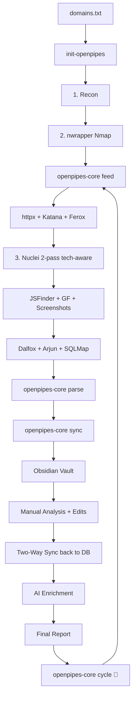

# 🔥 OPenPipeS - Obsidian Pentest Pipeline Stack

<div align="center">


Automated Reconnaissance and Pentesting Pipeline

Integrated with Obsidian MD for Smart Documentation

[](https://github.com/rlSniff3r/OPenPipeS)
[](LICENSE)
[](https://kali.org)

</div>

---

## 📋 Index

- [About](#-about)
- [Features](#-features)
- [Architecture](#-architecture)
- [Installation](#-installation)
- [Configuration](#-configuration)
- [Usage](#-usage)
- [Modules](#-modules)
- [Workflow](#-workflow)
- [Troubleshooting](#-troubleshooting)
- [Contributing](#-contributing)
- [License](#-license)
- [Acknowledgements](#-acknowledgements)
- [Contact](#-contact)

---

## 🎯 About

**OPenPipeS** (Obsidian Pentest Pipeline Stack) is a complete automation solution for reconnaissance and web application pentesting, with native integration into Obsidian MD for structured and intelligent documentation of results.

It evolved from a collection of bash scripts into a **hybrid framework**: a **Python "brain"** (SQLite single-source-of-truth, orchestration, parsing, rendering, two-way sync) orchestrated with **bash "muscle"** (the battle-tested tool wrappers that drive nmap, httpx, nuclei, feroxbuster and friends).

**The problem it solves:**

During a pentest, we collect tons of data from various tools (nmap, httpx, nuclei, etc.). Organizing, correlating, and documenting this information efficiently is challenging.

**OPenPipeS** automates the entire recon pipeline and organizes the results into a structured Obsidian Vault, with:

- ✅ SQLite as the single source of truth (hosts, ports, endpoints, vulns, tasks, evidence)
- ✅ Interactive dashboards (Obsidian + Web)
- ✅ **Two-way sync** — edit the vault, your changes flow back to the DB and survive re-renders
- ✅ Tech/port-aware Nuclei scans (2-pass: generic + targeted CVEs)
- ✅ Dynamic tables with Jinja2 templates
- ✅ Global Dashboard
- ✅ Ready‑to‑use vulnerability templates plus 100+ local cache vulnerability JSON files
- ✅ Automatic vulnerability enrichment with AI (With Gemini free API)
- ✅ Task tracking with persistent state
- ✅ Web Dashboard for panoramic view equiped with a fully-featured Database Manager

---

## ✨ Features

- 🔍 **Full Reconnaissance**: DNS, subdomains, WHOIS, RDAP
- 🎯 **Automated Scanning**: Nmap with optimized profiles (SYN, service/version, OS)
- 🌐 **Endpoint Discovery**: HTTPx, Katana, Feroxbuster
- 🧪 **Tech/Port-Aware Nuclei**: pass 1 = generic templates per detected tech; pass 2 = only the CVEs that apply to your fingerprints (up to 10x fewer templates, no dead-end timeouts)
- 📜 **JavaScript Analysis**: JSFinder for hidden endpoints
- 🧬 **Pattern Matching**: GF (GrepFuzzable) for organization
- 🔍 **Parameter Discovery**: Arjun with strict scope enforcement (in-scope hosts only)
- 💥 **XSS/SQLi Hunting**: Dalfox, SQLMap feeds from the DB
- 📸 **Screenshots**: automated with Gowitness
- 🏷️ **WHOIS Enrichment**: with dedicated module
- 🗄️ **SQLite Brain**: every tool output parsed into a relational DB (hosts, ports, endpoints, vulnerabilities, tasks, evidence)
- 🔄 **Feeder**: re-feeds tools from the DB (nwrapper, httpx, katana, ferox, nuclei, dalfox, arjun, sqlmap, wordlists)
- 📊 **Obsidian Integration**: Jinja2-rendered vault with YAML frontmatter
- 🔁 **Two-Way Sync**: user edits to hosts files, techs, tasks and vuln callouts are parsed back into the database and tracked for persistence
- 🖼️ **Evidence Persistence**: hash-deduped, survives re-renders and vault rebuilds
- 🤖 **AI‑Powered**: vulnerability enrichment with Gemini (Free) and OpenAI APIs
- 🎨 **Customizable**: editable Markdown templates (`.templates/`)
- 🔄 **Orchestrated Pipeline**: fully automated cycle with one command (`openpipes-core cycle`)
- 🖥️ **Web Dashboard**: live project overview and management with editable vulnerabilities and a fully featured database manager
- 💾 **Backups & Reinstall**: framework automated backups, `make reinstall`, with failure recovery safeguards

---

## 🏗 Architecture

### 🐧 OS Side (`~/.openpipes` + `~/Projetos`)

```
~/.openpipes/
│
├── openpipes_core/               # 🧠 Python "brain"
│   ├── cli.py                    # Main CLI 'openpipes-core' orchestrator
│   ├── db.py                     # SQLite schema + migrations
│   ├── renderer.py               # Jinja2 vault rendering
│   ├── sync.py                   # Two-way sync (MD → DB)
│   ├── feeder.py                 # Feed tools from DB
│   ├── parsers.py                # Tool output → DB parsers
│   ├── cycle.py                  # Full cycle orchestrator
│   ├── scope.py                  # Scope management
│   ├── verifier.py               # HTTP endpoint verification
│   ├── dashboard.py              # Web dashboard
│   ├── backup.py                 # Framework backups
│   └── vuln_*.py                 # Vuln management + AI enrichment
│
├── scripts/                      # 💪 Bash "muscle" wrappers
│   ├── recon.sh                  # Subdomain Bruteforce, RDAP queries, Host Discovery and Attack Surface Mapping
│   ├── nwrapper.sh               # Nmap wrapper with intelligent quick port mapper and depth Service and OS Discovery
│   ├── httpx-runner.sh           # Technology and Host response prober
│   ├── katana-runner.sh          # Web Server crawler
│   ├── feroxbuster-runner.sh     # Endpoint Brute Forcer with contextualized per-host and tech-based wordlists 
│   ├── nuclei-runner.sh          # 2-pass tech-aware
│   ├── jsfinder-runner.sh        # Javascript endpoints route and secrets discovery
│   ├── screenshot-runner.sh      # Screenshot taker with Gowitness for automated Visual Recon
│   ├── gf-summary.sh             # GreppableFuzzer for organizational params
│   ├── dalfox-runner.sh          # Automated XSS
│   ├── arjun-runner.sh           # Automated hidden param discovery
│   └── sqlmap-runner.sh          # Automated SQL Injection
│
├── .templates/                   # Jinja2 MD templates (target.j2, vuln.j2, ...)
├── config.sh                     # Global configuration
├── secrets.conf                  # API keys and Username/Passwords
├── .venv-core/                   # Isolated Python venv for the core
└── wordlists/                    # Prepared wordlists

~/Projetos/<cliente>/
├── domains.txt                   # Scope: one domain per line
├── .openpipes.db                 # 🗄️ SQLite brain
├── .openpipes_scope              # Scope overrides
├── Recon/                        # Recon results
├── Varreduras/                   # Scanning results
│   ├── targets.txt               # Automatidally generated target scan file based on defined scope
│   └── nmap-<host>/              # Host-specific folders
│       ├── nuclei_urls.txt       # Port-aware targets
│       ├── nuclei_tags.txt       # Tech-derived tags
│       ├── nuclei_pass1.json     # Tech based nuclei targets
│       ├── nuclei_pass2.json     # CVE based nuclei targets
│       ├── arjun_targets.txt     # Hidden param dicovery targets
│       ├── Screenshots/          # Screenshot folder
│       └── Evidencias/           # User-pasted evidence (canonical copy)
└── Evidencias/                   # (mirrored per host when enabled)
```

### 🗂 Vault Side (`~/.obsidianFixedMount/<projeto>`)

```
~/.obsidianFixedMount/<projeto>/Pentest/
├── Index.md                 # Project index
├── Dashboard_Global.md      # Global dashboard (mermaid severity pie)
├── Hosts_Panel.base
└── Alvos/
    └── <host>/
        ├── <host>.md        # Target note (frontmatter + techs + narrativa + tasks)
        ├── Vulnerabilidades/  # Per-vuln notes (vuln_id frontmatter, editable callouts)
        ├── Endpoints/       # Route-grouped endpoint tables
        ├── Evidencias/      # User-pasted images (rendered back from project)
        ├── Screenshots/     # Tool screenshots
        ├── nmap.md
        ├── js-discoveries.md
        ├── httpx-results.md
        └── screenshots.md
```

---

## 🚀 Installation

### Prerequisites

- OS: Kali Linux / Debian / Ubuntu
- Privileges: sudo (to install packages)
- Space: ~5GB (tools + wordlists)

### Quick Installation

```bash
# 1. Clone the repository
git clone https://github.com/rlSniff3r/OPenPipeS.git
cd OPenPipeS

# 2. Run the installer (bootstrap + apt/go/rust/python deps)
make install          # or: make reinstall  (backup → wipe → install → restore)

# 3. Reload shell
source ~/.bashrc

# 4. Configure the project
nano ~/.openpipes/config.sh

# 5. Run!
openpipes-core
```

**What the installer does:**

1. ✅ Installs APT dependencies (nmap, jq, curl, etc.)
2. ✅ Installs Go tools (httpx, nuclei, katana, gf, dalfox, gowitness)
3. ✅ Installs Rust tools (feroxbuster)
4. ✅ Installs Python tools (dnsrecon, arjun, etc.)
5. ✅ Clones SecLists and prepares wordlists
6. ✅ Creates an isolated Python venv (`.venv-core`) for the framework core
7. ✅ Copies scripts to `~/.openpipes/`
8. ✅ Adds `~/.openpipes/bin` to PATH
9. ✅ Creates the initial Obsidian structure
10. ✅ Copies the vulnerability cache (145+ templates)
11. ✅ `make reinstall` backs up your framework config first and restores it

---

## ⚙️ Configuration

Edit `~/.openpipes/config.sh`:

```bash
# Directory where your pentest projects are stored
proj_dir="$HOME/Projetos"

# Name of the current project
proj_name="cliente-xyz"

# Obsidian vault mount (fixed)
obsdir="$HOME/.obsidianFixedMount"

# Derived paths (auto)
proj_path="$proj_dir/$proj_name"
NMAP_DIR="$proj_path/Varreduras"
RECON_DIR="$proj_path/Recon"
OSINT_DIR="$proj_path/OSINT"
```

API keys go in `~/.openpipes/secrets.conf` (optional but recommended):

```bash
securitytrailskey="your-key-here"
OPENAI_API_KEY="sk-..."
GOOGLE_API_KEY="..."
GOOGLE_API_CX="..."
```

### Project Directory Structure

OPenPipeS expects the following structure:

```
~/Projetos/cliente-xyz/
├── domains.txt              # Domain list (one per line) — the scope
├── Recon/                   # Recon results
└── Varreduras/              # Scanning results
    ├── targets.txt          # Auto-generated
    └── nmap-*/              # Host-specific folders
```

---

## 🎮 Usage

### Main Command

```bash
openpipes-core
```

Opens the interactive menu, or use the CLI directly:

| Command | Description |
|---------|-------------|
| `openpipes-core run <module>` | Run a bash module + auto-parse results |
| `openpipes-core feed` | Re-feed tools from the DB (scope/tech-aware) |
| `openpipes-core cycle` | Full cycle: feed → run → verify → sync |
| `openpipes-core sync` | Render the vault (with two-way sync ingest) |
| `openpipes-core parse <module>` | Re-parse a module's outputs |
| `openpipes-core scope edit/show` | Manage scan scope (fzf) |
| `openpipes-core vuln` | Manage/enrich vulnerabilities (TUI) |
| `openpipes-core verify` | Validate endpoints via HTTP |
| `openpipes-core backup` | Create/list/restore backups |
| `openpipes-core dashboard` | Start the web dashboard |

### First Steps

```bash
# 1. Initialize a project
init-openpipes            # pick your client name → creates structure

# 2. Define the scope
cd ~/Projetos/cliente-xyz
echo "exemplo.com" > domains.txt

# 3. Run the full pipeline
openpipes-core cycle

# 4. Open Obsidian on ~/.obsidianFixedMount/ and explore the vault
# 5. Edit Narrativa, toggle tasks, mark vulns as false positives — sync keeps it all
```

---

## 📦 Modules

### 🧠 Python "Brain" (`openpipes_core/`)

- **`cli.py`** — command-line interface + interactive menu (modules, DB, sync, cycle, backups, dashboard)
- **`db.py`** — SQLite schema (projects, hosts, ports, endpoints, injectable_params, screenshots, js_discoveries, tasks, user_evidences, vulnerabilities, execution_logs) with safe migrations
- **`renderer.py`** — Jinja2 vault rendering (target, vuln, dashboard, index, endpoint groups)
- **`sync.py`** — **two-way sync**: reads user edits from the vault (techs, narrative, tasks, vuln callouts, pasted images) back into the DB before rendering
- **`feeder.py`** — builds per-host tool inputs from the DB: port-aware nuclei URLs, tech-derived tags, arjun targets (scope-enforced), dalfox/sqlmap/gf/screenshot feeds, wordlists
- **`parsers.py`** — converts every tool output into DB rows (recon, nmap, httpx, ferox/katana, screenshots, nuclei pass1/pass2, whois, dalfox, arjun) and marks endpoints as scanned
- **`cycle.py`** — orchestrates feed → run → parse → verify → sync; watch/rescan/fresh modes
- **`scope.py`** — interactive scope management (edit/show)
- **`verifier.py`** — HTTP endpoint verification
- **`dashboard.py`** — live web dashboard
- **`backup.py`** — framework backup/restore (used by `make reinstall`)
- **`vuln_*.py`** — vulnerability management, creation, listing and AI enrichment

### 💪 Bash "Muscle" (`scripts/`)

- **`recon.sh`** — DNS/subdomain/WHOIS/RDAP discovery → `Recon/<domain>/`
- **`nwrapper.sh`** — nmap SYN + service/version/OS detection → `Varreduras/nmap-<host>/`
- **`httpx-runner.sh`** — HTTP/HTTPS probing + tech detection
- **`katana-runner.sh` / `feroxbuster-runner.sh`** — crawling + directory brute-force
- **`nuclei-runner.sh`** — **2-pass**: pass 1 generic (base + tech tags), pass 2 CVEs filtered by detected techs (`-tc`), port-aware targets, `-max-host-error` tuning
- **`jsfinder-runner.sh`** — JS discovery + hidden endpoint extraction
- **`screenshot-runner.sh`** — automated screenshots (Gowitness)
- **`gf-summary.sh`** — pattern grouping (XSS, SQLi, LFI…)
- **`dalfox-runner.sh` / `arjun-runner.sh`** — XSS hunting + hidden parameter discovery
- **`whois-enricher.sh`** — ownership enrichment
- **`wordlist-builder`** — context-aware wordlists from discovered endpoints

---

## 🔄 Recommended Workflow


```mermaid
graph TD
    A[domains.txt] --> B[init-openpipes]
    B --> C[1. Recon]
    C --> D[2. nwrapper Nmap]
    D --> E[openpipes-core feed]
    E --> F[httpx + Katana + Ferox]
    F --> G[3. Nuclei 2-pass tech-aware]
    G --> H[JSFinder + GF + Screenshots]
    H --> I[Dalfox + Arjun + SQLMap]
    I --> J[openpipes-core parse]
    J --> K[openpipes-core sync]
    K --> L[Obsidian Vault]
    L --> M[Manual Analysis + Edits]
    M --> N[Two-Way Sync back to DB]
    N --> O[AI Enrichment]
    O --> P[Final Report]
    P --> Q[openpipes-core cycle 🔁]
    Q --> E
```

**Step-by-step:**

1. Prepare the environment:
   ```bash
   cd ~/Projetos/cliente-xyz
   echo "exemplo.com" > domains.txt
   ```

2. Initialize and run the first recon:
   ```bash
   init-openpipes
   openpipes-core run recon
   ```

3. Scan ports and create targets:
   ```bash
   openpipes-core run nwrapper
   openpipes-core sync
   ```

4. Run the web discovery + analysis stack:
   ```bash
   openpipes-core cycle
   ```

5. Open Obsidian on `~/.obsidianFixedMount/`, navigate the dashboards, add notes and tasks.

6. Document vulnerabilities:
   ```bash
   openpipes-core vuln
   ```

7. Let your manual edits flow back:
   ```bash
   openpipes-core sync   # two-way: MD → DB → MD
   ```

---

## 🛠 Troubleshooting

**Problem: "Script not found"**

```bash
source ~/.bashrc
echo $PATH | grep -i openpipes
```

**Problem: "Incomplete configuration"**

```bash
nano ~/.openpipes/config.sh
# Fill in proj_dir and proj_name
```

**Problem: Tool not installed**

```bash
openpipes-core run <module>   # errors will point at the missing binary
# or re-run the installer:  cd OPenPipeS && make install
```

**Problem: Obsidian does not open files**

- Make sure Obsidian is pointing to `~/.obsidianFixedMount/`
- Check permissions: `chmod -R 755 ~/.obsidianFixedMount/`

**Problem: OpenAI API not working**

```bash
grep OPENAI ~/.openpipes/secrets.conf
curl https://api.openai.com/v1/models \
  -H "Authorization: Bearer sk-..."
```

**Problem: Sync overwrote my edits**

- The two-way sync only touches the anchored regions (`Narrativa Técnica`, tech bullets, tasks, vuln callouts, `Evidencias/`). Everything else is regenerated by design.

---

## 🤝 Contributing

Contributions are welcome! Follow these steps:

1. Fork the project
2. Create a branch (`git checkout -b feature/AmazingFeature`)
3. Commit your changes (`git commit -m 'Add AmazingFeature'`)
4. Push to the branch (`git push origin feature/AmazingFeature`)
5. Open a Pull Request

---

## 📜 License

Distributed under the MIT License. See `LICENSE` for more information.

---

## 🙏 Acknowledgments

- **[Wyuld](https://github.com/Wyuld)**: My friend Brayan who oferred great help and key insights through develpment.
- **ProjectDiscovery** — httpx, nuclei, katana
- **OWASP** — amass, testing guides
- **Obsidian** — best notes app ever!
- **Kali Linux** — pentesting environment
- **Jinja2 / Rich / SQLite** — the brain's best friends

---

## 📞 Contact

**Rafael Luís da Silva**

📧 Email: rafael@safeserviceinfo.com  
🐦 Twitter: @rlSniff3r  
💼 LinkedIn: Rafael Luís da Silva

---

<div align="center">

⭐ If this project helped you, leave a star! ⭐

Made with ❤️ and ☕ by Rafael Luís da Silva

</div>
