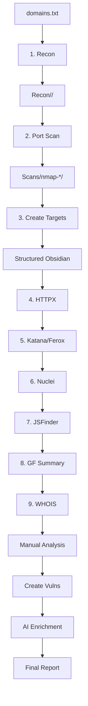

🔥 OPenPipeS - Obsidian Pentest Pipeline Stack

<div align="center">


Automated Reconnaissance and Pentesting Pipeline

Integrated with Obsidian MD for Smart Documentation

[](https://github.com)
[](LICENSE)
[](https://kali.org)

</div>

---

📋 Index

- About
- Features
- Architecture
- Installation
- Configuration
- Usage
- Modules
- Workflow
- Troubleshooting
- Contributing

---

🎯 About

OPenPipeS (Obsidian Pentest Pipeline Stack) is a complete automation solution for reconnaissance and web application pentesting, with native integration into Obsidian MD for structured and intelligent documentation of results.

Problem it solves:

During a pentest, we collect tons of data from various tools (nmap, httpx, nuclei, etc.). Organizing, correlating, and documenting this information efficiently is challenging.

OPenPipeS automates the entire recon pipeline and organizes the results into a structured Obsidian Vault, with:

- ✅ Interactive dashboards  
- ✅ Dynamic tables with DataviewJS  
- ✅ Navigation through links between targets  
- ✅ Ready‑to‑use vulnerability templates  
- ✅ Automatic enrichment with AI  

---

✨ Features

- 🔍 Full Reconnaissance: DNS, subdomains, WHOIS, RDAP  
- 🎯 Automated Scanning: Nmap with optimized profiles  
- 🌐 Endpoint Discovery: HTTPx, Katana, Feroxbuster  
- 🧪 Vulnerability Assessment: Nuclei with updated templates  
- 📜 JavaScript Analysis: LinkFinder for hidden endpoints  
- 🧬 Pattern Matching: GF (GrepFuzzable) for organization  
- 📊 Obsidian Integration: Structured and dynamic documentation  
- 🤖 AI‑Powered: Vulnerability enrichment with OpenAI  
- 🎨 Customizable: Editable Markdown templates  
- 🔄 Orchestrated Pipeline: Run everything with one command  

---

🏗 Architecture

```
OPenPipeS/
│
├── .openpipes/
│   ├── bin/                    # Executable scripts (in PATH)
│   ├── scripts/                # Source scripts
│   ├── .templates/             # Obsidian/Markdown templates
│   └── config.sh               # Global configuration
│
├── .openpipes_cache/           # Vulnerability cache (JSON)
│
└── ~/.obsidianFixedMount/      # Obsidian Vault
    └── Pentest/
        ├── Targets/
        │   └── example.com/
        │       ├── example.com.md
        │       ├── Dashboard_example.com.md
        │       ├── Vulnerabilities/
        │       ├── nmap.md
        │       ├── httpx.md
        │       ├── nuclei.md
        │       └── endpoints.md
        │
        ├── Dashboard_Global.md
        └── Tasks.md
```

---
🚀 Installation

Prerequisites

- OS: Kali Linux / Debian / Ubuntu  
- Privileges: sudo (to install packages)  
- Space: ~5GB (tools + wordlists)  

Quick Installation

`bash
1. Clone the repository
git clone https://github.com/your-user/OPenPipeS.git
cd OPenPipeS

2. Run the installer
chmod +x install.sh
./install.sh

3. Reload shell
source ~/.bashrc

4. Configure the project
nano ~/.openpipes/config.sh

5. Run!
openpipes
`

What the installer does:

1. ✅ Installs APT dependencies (nmap, jq, curl, etc.)  
2. ✅ Installs Go tools (httpx, nuclei, katana, gf)  
3. ✅ Installs Rust tools (feroxbuster)  
4. ✅ Installs Python tools (LinkFinder, dnsrecon)  
5. ✅ Clones SecLists and prepares wordlists  
6. ✅ Copies scripts to ~/.openpipes/  
7. ✅ Adds ~/.openpipes/bin to PATH  
8. ✅ Creates initial Obsidian structure  
9. ✅ Copies vulnerability cache (145 templates!)  

---

⚙️ Configuration

Edit ~/.openpipes/config.sh:

```bash
Directory where your pentest projects are stored
proj_dir="/home/kali/pentests"

Name of the current project
proj_name="client-xyz"

Obsidian directory (usually fixed)
obsdir="$HOME/.obsidianFixedMount/"

API Keys (optional but recommended)
securitytrailskey="your-key-here"
OPENAI_API_KEY="sk-..."
```

Project Directory Structure

OPenPipeS expects the following structure:

```
/home/kali/pentests/client-xyz/
├── domains.txt              # Domain list (one per line)
├── Recon/                   # Recon results
└── Scans/                   # Scanning results
    ├── targets.txt          # Auto-generated
    └── nmap-*/              # Host-specific folders
```

---

🎮 Usage

Main Command

```bash
openpipes
```

This opens the interactive menu:

```
╔════════════════════════════════════════════════════════════╗
║              MAIN MENU - OPenPipeS                        ║
╚════════════════════════════════════════════════════════════╝

[1] 🔍 Full Reconnaissance
[2] 🎯 Port/Service Scan
[3] 📦 Create Structure in Obsidian
[4] 🌐 HTTPX Runner
[5] 🔗 Katana + Feroxbuster
[6] 🧪 Nuclei Scanner
[7] 📜 JSFinder
[8] 🧬 GF Summary
[9] 🏷️ WHOIS Enricher

[V] 💥 Manage Vulnerabilities
[P] 🔄 Full Pipeline (All modules)

[C] ⚙️ Configuration
[S] 📊 System Status
[H] 📖 Help/Documentation

[0] 🚪 Exit
```

Direct Script Usage

```bash
Recon
recon.sh -d domains.txt

Port scan
nwrapper.sh -t 192.168.1.1,scanme.nmap.org

HTTPx
httpx-runner.sh

Full pipeline
openpipes  # choose option [P]
```

---

📦 Modules

1️⃣ Reconnaissance (recon.sh)

What it does:
- DNS enumeration (A, TXT, CNAME, DMARC)  
- Subdomain discovery (dnsrecon, amass, SecurityTrails)  
- RDAP/WHOIS lookup  
- Initial HTTPx probe  

Output:
- Recon/<domain>/allsubs  
- Recon/<domain>/hosts-allsubs  
- Recon/<domain>/allsubs.httpx.json  
- Scans/targets.txt  

2️⃣ Port Scan (nwrapper.sh)

What it does:
- nmap SYN scan (-sS)  
- Open port detection  
- Service/version detection (-sV)  
- OS detection (-O)  

Output:
- Scans/nmap-<host>/initial  
- Scans/nmap-<host>/nmap.nmap  
- Scans/nmap-<host>/nmap.gnmap  

3️⃣ Target Creation (cria_Alvos_Obsidian.sh)

What it does:
- Reads nmap results  
- Creates folder structure in Obsidian  
- Generates per-target dashboards  
- Creates YAML frontmatter  

Output:
- Obsidian/Pentest/Targets/<host>/<host>.md  
- Obsidian/Pentest/Targets/<host>/Dashboard_<host>.md  
- Obsidian/Pentest/Targets/<host>/Vulnerabilities/  

4️⃣ HTTPX Runner (httpx-runner.sh)

What it does:
- HTTP/HTTPS probing  
- Technology detection  
- Page title capture  
- Automatic deduplication  

Output:
- Obsidian/Pentest/Targets/<host>/httpx.md  
- Obsidian/Pentest/Targets/<host>/endpoints.md  

5️⃣ Katana + Feroxbuster (katana-buster.sh)

What it does:
- Katana: web crawler  
- Feroxbuster: directory brute-force  
- Combined for maximum coverage  

Flags:
- --dns-only  
- --ip-only  

Output:
- Obsidian/Pentest/Targets/<host>/ferox-katana.md  
- endpoints.md updated  

6️⃣ Nuclei (nuclei-runner.sh)

What it does:
- Runs nuclei templates  
- Severity filtering  
- Structured reporting  

Output:
- nuclei-output/<host>-nuclei.json  
- nuclei.md  

7️⃣ JSFinder (jsfinder-runner.sh)

What it does:
- Identifies .js files  
- Downloads and analyzes with LinkFinder  
- Extracts hidden endpoints  

Output:
- js-endpoints.md

8️⃣ GF Summary (gf-summary.sh)

What it does:
- Groups endpoints by patterns (XSS, SQLi, LFI, etc.)  
- Identifies sensitive extensions  
- Supports manual analysis  

Output:
- gf-summary.md

9️⃣ WHOIS Enricher

What it does:
- Extracts ownership information  
- Updates dashboards  

---

🔄 Recommended Workflow


```mermaid
graph TD
    A[domains.txt] --> B[1. Recon]
    B --> C[Recon/<domain>/]
    C --> D[2. Port Scan]
    D --> E[Scans/nmap-*/]
    E --> F[3. Create Targets]
    F --> G[Structured Obsidian]
    G --> H[4. HTTPX]
    H --> I[5. Katana/Ferox]
    I --> J[6. Nuclei]
    J --> K[7. JSFinder]
    K --> L[8. GF Summary]
    L --> M[9. WHOIS]
    M --> N[Manual Analysis]
    N --> O[Create Vulns]
    O --> P[AI Enrichment]
    P --> Q[Final Report]
```

Step-by-step:

1. Prepare the environment:
   ```bash
   cd /home/kali/pentests/cliente-xyz
   echo "exemplo.com" > domains.txt
   ```

2. Execute the reconnaissance:
   ```bash
   openpipes  # [1] Reconhecimento
   ```

3. Perform the scan:
   ```bash
   openpipes  # [2] Scan de Portas
   ```

4. Create the structure:
   ```bash
   openpipes  # [3] Criar Alvos Obsidian
   ```

5. Execute the web modules:
   ```bash
   openpipes  # [4] HTTPX
   openpipes  # [5] Katana/Ferox
   openpipes  # [6] Nuclei
   ```

6. JavaScript analysis:
   ```bash
   openpipes  # [7] JSFinder
   openpipes  # [8] GF Summary
   ```

7. Enrich metadata:
   ```bash
   openpipes  # [9] WHOIS Enricher
   ```

8. Open Obsidian:
   - Open the vault in ~/.obsidianFixedMount/
   - Navigate through the dashboards
   - Add notes and tasks

9. Document vulnerabilities:
   ```bash
   openpipes  # [V] Gerenciar Vulnerabilidades
   ```

---

🛠 Troubleshooting

Problem: "Script not found"

Solution:
```bash
source ~/.bashrc
echo $PATH | grep openpipes
```

Problem: "Incomplete configuration"

Solution:
```bash
nano ~/.openpipes/config.sh
Fill in proj_dir and proj_name
```

Problem: Tool not installed

Solution:
```bash
openpipes  # [S] System Status
See what's missing and install manually
```

Problem: Obsidian does not open files

Solution:
- Make sure Obsidian is pointing to ~/.obsidianFixedMount/
- Check permissions: chmod -R 755 ~/.obsidianFixedMount/

Problem: OpenAI API not working

Solution:
```bash
Check your key
grep OPENAI ~/.openpipes/config.sh

Test manually
curl https://api.openai.com/v1/models \
  -H "Authorization: Bearer sk-..."
```

---

🤝 Contributing

Contributions are welcome! Follow these steps:

1. Fork the project
2. Create a branch (git checkout -b feature/AmazingFeature)
3. Commit your changes (git commit -m 'Add AmazingFeature')
4. Push to the branch (git push origin feature/AmazingFeature)
5. Open a Pull Request

---

📜 License

Distributed under the MIT License. See LICENSE for more information.

---

🙏 Acknowledgments

- ProjectDiscovery - httpx, nuclei, katana
- OWASP - amass, testing guides
- Obsidian - best notes app ever!
- Kali Linux - pentesting environment

---

📞 Contact

Rafael Luís da Silva

📧 Email: rafael@sintetic.com.br  
🐦 Twitter: @rlSniff3r  
💼 LinkedIn: Rafael Luís da Silva

---

<div align="center">

⭐ If this project helped you, leave a star! ⭐

Made with ❤️ and ☕ by Rafael Luís da Silva

</div>
